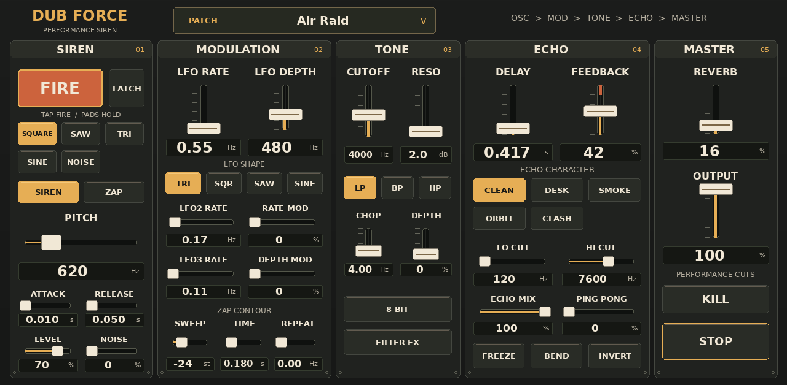

# Dub Force Siren

Download the [1.0.1 release candidate ZIP](dist/Dub-Force-Siren-1.0.1-mpc-armv7.zip).
The [1.0.0 ZIP](dist/Dub-Force-Siren-1.0.0-mpc-armv7.zip) is retained for rollback.
See [installation instructions](docs/INSTALL_FORCE.md) before installing.

Native ARM VST2 dub siren for Akai Force/MPC OS. The engine ports BARZINE Siren
Deck mappings and echo topology into C++, connected to sd88me's MPC wrapper,
parameter system, native touchscreen skin, Q-Links and portable installer.
Attribution and preserved notices are in [NOTICE.md](NOTICE.md) and [VENDORED.md](VENDORED.md).

Five oscillator waves; free-running main/nested LFOs; exponential ZAP/repeat;
attack/release, MIDI gates, LATCH and tap FIRE; chop, 8bit and LP/BP/HP tone;
oscillator/master EQ; five genuinely different echo characters; loop HP/LP,
saturation, wet panning/inversion, freeze, bend, spread and flange; stereo
algorithmic reverb; stereo compression/limiting; twelve factory presets and
versioned project state. All main sound controls share one touchscreen panel.
Secondary EQ/modifiers have a utility tab. Q-Link bank changes reuse the main panel.



The preview illustrates artwork/placement. Native MPC draws parameter values
and active states live; the offline preview displays factory defaults; native values update live.

```sh
./tools/build.sh host       # desktop Linux .so for offline checks
./tools/build.sh test       # ASan/UBSan, DSP/ABI/state/fuzz/realtime allocation tests
./tools/build.sh arm        # real32-bit ARM hard-float hardware .so
./tools/skin.sh             # native skin, Q-Links, metadata and preview
./tools/package.sh          # checksummed portable ARM install ZIP
```

Host requirements: GCC/G++, Python3, Pillow for skin artwork/preview; Docker for
cross compilation. The existing glibc2.31 cross image is selected by default.
To build the same toolchain on another machine:

```sh
docker build -t dub-force-arm -f tools/Dockerfile.arm .
DUB_ARM_IMAGE=dub-force-arm ./tools/build.sh arm
```

Hardware artifact: `build/arm/dub_force_siren.so`. Installer package:
`dist/Dub-Force-Siren-1.0.1-mpc-armv7.zip`. Standalone demonstrations are generated
by `tools/render_demo.cpp`; presets by `tools/export_presets.cpp`. The included
factory preset selector works without loading external files.

Requires a 44.1kHz native host. MIDI timing follows the reference 128-frame wrapper;
it is not sample-accurate. Touch FIRE is a 250ms siren tap/full ZAP, MIDI pads
provide press/release and LATCH sustains. Modifier switches toggle. Reverb,
oscillator bandlimiting, compressor and feedback oversampling differ from browser
internals; no audible equivalence claim is made. Browser XY, backing riddim,
looper and recording are not implemented. No SPACE character exists in the
examined Deck source; Space Echo is an original preset.

See [build results](docs/BUILD.md), [DSP/reference limits](docs/DSP.md),
[parameter contract](docs/PARAMETERS.md), [installation](docs/INSTALL_FORCE.md),
[device evidence and manual checklist](docs/DEVICE_TEST.md), and [TODO](TODO.md).

Version 1.0.1 is installed on the Force. CPU p99 fell from 19.6% to 11.0% in
the installed stress benchmark; [performance evidence](docs/PERFORMANCE.md) and
[three UI iterations](docs/UI_REDESIGN.md) document the changes and limits.

Release hardening is recorded in [the RC audit](docs/RELEASE_CANDIDATE.md).
Complete the [numbered 10–15 minute Force test card](docs/MANUAL_FORCE_TEST_CARD.md)
for physical touch, listening, Q-Links and project reload validation.
